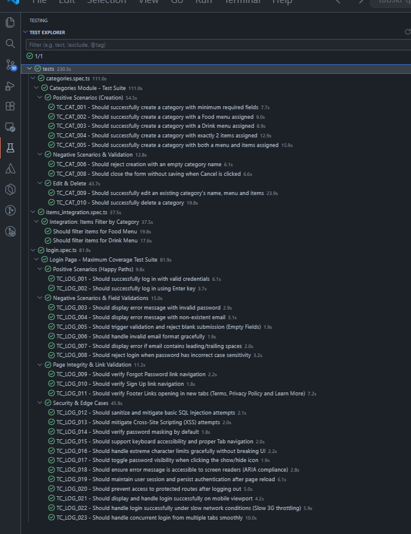

# Tabski QA Automation – Technical Assignment

End-to-end test automation suite for the Tabski Reporting Platform, built with **Playwright** and **TypeScript** using the **Page Object Model (POM)** pattern.

This repository covers both parts of the technical assignment:

- **Task 1:** Full functional, security, and accessibility coverage of the Login page
- **Task 2:** Category creation (Task A) and item filtering by category (Task B), including an end-to-end integration test connecting the two

---

## Tech Stack

| Tool | Purpose |
|---|---|
| [Playwright](https://playwright.dev) | Browser automation & test runner |
| TypeScript | Language |
| Page Object Model | Test architecture pattern |

---

## Project Structure

```
.
├── docs/
│   ├── Login_Test_Cases.md
│   ├── Categories_Page_Test_Cases.md
│   └── Items_Integration_Test_Cases.md
├── pages/
│   ├── LoginPage.ts
│   ├── NavigationMenu.ts
│   ├── CategoriesPage.ts
│   └── ItemsPage.ts
├── tests/
│   ├── login.spec.ts
│   ├── categories.spec.ts
│   └── items_integration.spec.ts
├── playwright.config.ts
├── package.json
└── README.md
```

---

## Prerequisites

- [Node.js](https://nodejs.org/) v18 or higher
- npm (comes bundled with Node.js)

---

## Setup Instructions

### 1. Clone the repository

```bash
git clone <repository-url>
cd tabski-qa-marijana
```

### 2. Install dependencies

```bash
npm install
```

### 3. Install Playwright browsers

```bash
npx playwright install
```

---

## Running the Tests

The base URL (`https://reporting-qa.tabski.com`) is already configured in `playwright.config.ts`, so no `.env` file or additional setup is required.

### Run the entire suite (headless)

```bash
npx playwright test
```

### Run a specific test file

```bash
npx playwright test tests/login.spec.ts
npx playwright test tests/categories.spec.ts
npx playwright test tests/items_integration.spec.ts
```

### Run tests in headed mode (see the browser)

```bash
npx playwright test --headed
```

### Run tests in UI mode (interactive debugging)

```bash
npx playwright test --ui
```

### View the HTML report after a run

```bash
npx playwright show-report
```
### Test Execution Report
<p align="center">
  
</p>

Trace files and screenshots for any failed run are automatically captured (`trace: 'on-first-retry'`, `screenshot: 'on'`, `video: 'retain-on-failure'`) and are viewable via the Playwright HTML report or the [Trace Viewer](https://trace.playwright.dev).

---

## Test Coverage Overview

### Task 1 – Login (`tests/login.spec.ts`)

23 test cases covering happy paths, field validation, page/link integrity, security (SQL injection, XSS), accessibility (ARIA, keyboard navigation), session persistence, logout, responsive/mobile viewport, network throttling, and concurrent-session handling.

Full test case documentation: [`docs/Login_Test_Cases.md`](./docs/Login_Test_Cases.md)

### Task 2A – Category Creation (`tests/categories.spec.ts`)

10 test cases covering category creation (with/without menu and items), validation (empty name, duplicate name), the cancel flow, editing an existing category, and deletion.

Full test case documentation: [`docs/Categories_Page_Test_Cases.md`](./docs/Categories_Page_Test_Cases.md)

### Task 2B – Item Filtering by Category (`tests/items_integration.spec.ts`)

End-to-end integration tests that log in, create a uniquely named category with 2 assigned items, navigate to the Items page, filter by that category, and assert that **exactly 2** matching items are displayed — satisfying the assignment's explicit assertion requirement. Parametrized to run the full flow twice: once against the Food Menu and once against the Drink Menu.

Full test case documentation: [`docs/Items_Integration_Test_Cases.md`](./docs/Items_Integration_Test_Cases.md)

---

## Important Notes

- **Shared test environment:** All candidates run tests against the same QA merchant account. Every category created by the suite uses a dynamically generated unique name via `generateUniqueName()` (pattern: `test-kategorija-marijana-[suffix]-[timestamp]`) to avoid collisions with other candidates' data.
- **Test credentials:** `qa.test@tabski.com` / `Test123!@#`, merchant: **Sushi Bistro**.
- **Independent test data:** Each test case creates its own category rather than relying on shared fixtures, so tests can be run individually or in any order without side effects on one another.
- **Proof of execution:** Pre-generated `playwright-report/` and `test-results/` folders are included in this repository as a record of a fully passing local run (`status: "passed"`, no failed tests). Re-running `npx playwright test` will regenerate these folders with a fresh report.

---

## Known Limitations

- **Category/menu dropdown interactions use blind keyboard typing** (`page.keyboard.type` + `Enter`) rather than role-based locators. The underlying Ant Design `Select` component does not expose its options through standard accessibility roles in a way Playwright can reliably wait on, so typing-to-filter combined with explicit waits was used as the more stable approach for this specific UI library.
- **`deleteCategory()` assumes a "Food Menu" assignment** when cleaning up a non-empty category before deletion. This matches the data shape used by the tests in this suite; it is not a fully generic utility for categories with arbitrary menu assignments.
- **The concurrent-session test (`TC_LOG_023`)** relies on a "Reload" conflict modal appearing when a second tab logs in — this is expected, intentional application behavior (blocking duplicate sessions), not a flaky wait condition.
- Tests assume the QA environment and its seeded data (e.g. items "Miso soup", "Ebi tempura", "7 Up", "Mochi Cappuccino") remain available and unchanged. If the underlying test data is reset or renamed in the environment, the corresponding specs will need updating.

---

## Author

QA Engineer Marijana Nicic – Technical Assignment Submission
